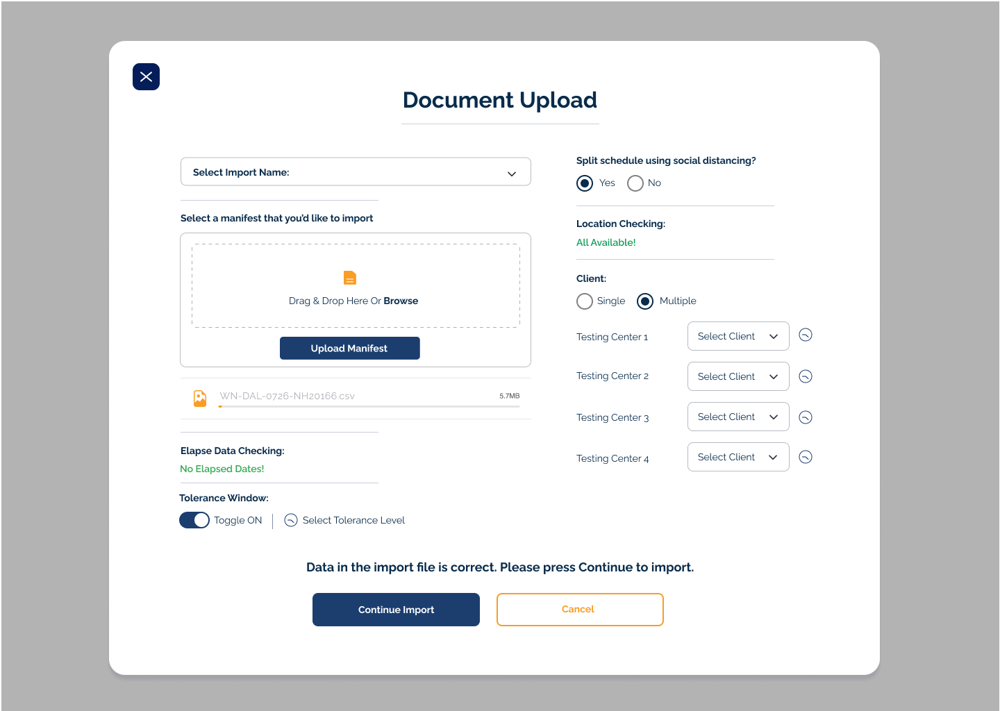

# Utilizing NextJS | ChakraUI

This is a [Next.js](https://nextjs.org/) project bootstrapped with [`create-next-app`](https://github.com/vercel/next.js/tree/canary/packages/create-next-app).

## Requirements



- Attached is a mockup of a fictional screen.
- Create a react single page application that serves this page in the browser.
- The only requirement is that you make it look exactly like the mockup using react components, form fields and any other technology you think makes sense.

Extra credit:

- Make the drag & drop work to where I can put a file on the page and the filename pops up.
- Submit this assignment via a github link with multiple commits.

## Getting Started

Install packages:

```bash
npm i
# or
yarn
# or
pnpm i
```

First, run the development server:

```bash
npm run dev
# or
yarn dev
# or
pnpm dev
```

Open [http://localhost:3000](http://localhost:3000) with your browser to see the result.

You can start editing the page by modifying `pages/index.tsx`. The page auto-updates as you edit the file.

[API routes](https://nextjs.org/docs/api-routes/introduction) can be accessed on [http://localhost:3000/api/hello](http://localhost:3000/api/hello). This endpoint can be edited in `pages/api/hello.ts`.

The `pages/api` directory is mapped to `/api/*`. Files in this directory are treated as [API routes](https://nextjs.org/docs/api-routes/introduction) instead of React pages.

This project uses [`next/font`](https://nextjs.org/docs/basic-features/font-optimization) to automatically optimize and load Inter, a custom Google Font.

## Lint and Format

We are using Prettier and ESLint that comes with Create Next App.

```bash
yarn lint
```

```terminal
(base) ➜ document-upload (main) ✗ yarn lint
yarn run v1.22.19
warning package.json: No license field
$ next lint
✔ No ESLint warnings or errors
✨  Done in 1.48s.
```

```bash
yarn prettier . --write
```

```terminal
(base) ➜ document-upload (main) ✗ yarn prettier . --write
yarn run v1.22.19
warning package.json: No license field
$ /Users/juanparra/professional/github/document-upload/node_modules/.bin/prettier . --write
.eslintrc.json 19ms (unchanged)
next.config.js 5ms (unchanged)
package.json 2ms (unchanged)
README.md 24ms
src/components/DocumentUpload/CheckingSection.tsx 95ms (unchanged)
src/components/DocumentUpload/ClientSection.tsx 4ms (unchanged)
src/components/DocumentUpload/ColumnRowStack.tsx 24ms (unchanged)
src/components/DocumentUpload/CustomButton.tsx 6ms (unchanged)
src/components/DocumentUpload/CustomModal.tsx 5ms (unchanged)
src/components/DocumentUpload/CustomModalHeader.tsx 2ms (unchanged)
src/components/DocumentUpload/CustomRadioGroup.tsx 3ms (unchanged)
src/components/DocumentUpload/SelectStackSection.tsx 2ms (unchanged)
src/components/DocumentUpload/TestingCenterStack.tsx 4ms (unchanged)
src/components/DocumentUpload/ToleranceWindow.tsx 2ms (unchanged)
src/components/DocumentUpload/UploadedFileInfo.tsx 3ms (unchanged)
src/pages/_app.tsx 2ms (unchanged)
src/pages/_document.tsx 2ms (unchanged)
src/pages/api/hello.ts 2ms (unchanged)
src/pages/index.tsx 2ms (unchanged)
src/styles/theme.ts 1ms (unchanged)
tsconfig.json 2ms (unchanged)
✨  Done in 0.49s.
```

## Learn More

To learn more about Next.js, take a look at the following resources:

- [Next.js Documentation](https://nextjs.org/docs) - learn about Next.js features and API.
- [Learn Next.js](https://nextjs.org/learn) - an interactive Next.js tutorial.

You can check out [the Next.js GitHub repository](https://github.com/vercel/next.js/) - your feedback and contributions are welcome!

## Deploy on Vercel

The easiest way to deploy your Next.js app is to use the [Vercel Platform](https://vercel.com/new?utm_medium=default-template&filter=next.js&utm_source=create-next-app&utm_campaign=create-next-app-readme) from the creators of Next.js.

Check out our [Next.js deployment documentation](https://nextjs.org/docs/deployment) for more details.

## Future Considerations

1. If needed add some state management (Redux, Recoil, etc)
2. Add tests (unit, component, E2E)
3. Add GitHub actions to run any linting, formatting, and testing on PR (CI/CD)
4. Incorporate a more robust theme, so that its defined one place and the same standard is used through app and components
5. Incorporate new feautes
